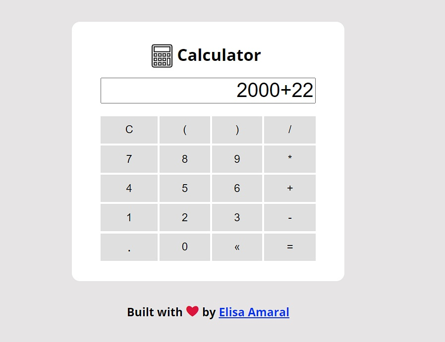

# Calculator built with JavaScript Factory Function

This project is a simple calculator that runs expressions of the four basic math operations, a refactoring of the Calculator built with JavaScript-Factory Function.

## Project Link

**coming soon**

## Screenshot

## Technology Stack

+ JavaScript
+ CSS
+ HTML
