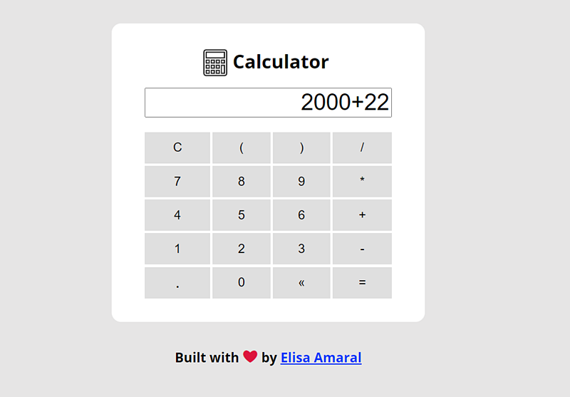

# Calculator built with JavaScript Constructor Function

This project is a refactoring of the [Calculator built with JavaScript Factory Function](https://github.com/elisa-amaral/Calculator-built-with-JavaScript-Factory-Function). It's a simple calculator that runs expressions of the four basic math operations, built with the JavaScript Constructor Function.

## Project Link

https://calculator-js-constructor-function.netlify.app/

## Screenshot

## Technology Stack

+ JavaScript
+ HTML
+ CSS

